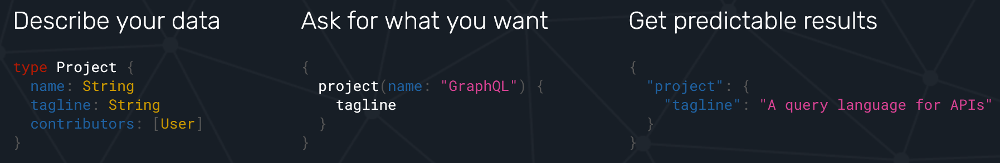
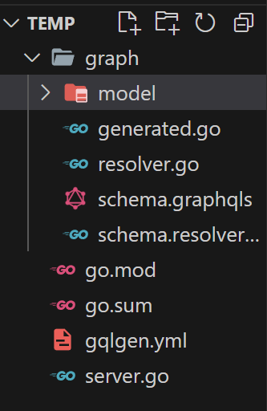
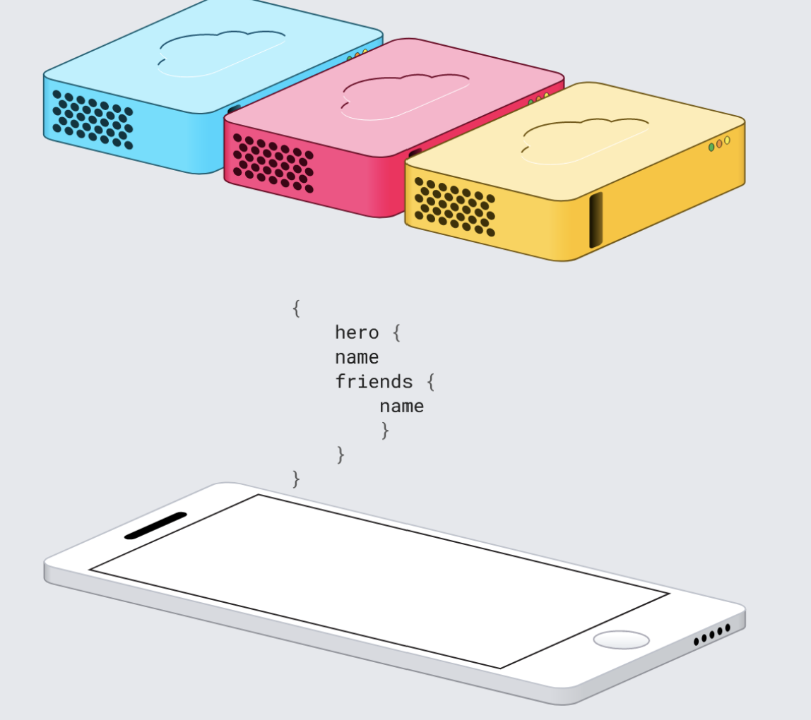

# GraphQL

GraphQL is an open-source data query and manipulation language for APIs and a query runtime engine. 

It enables declarative data fetching where a client can specify exactly what data it needs from an API. Instead of multiple endpoints that return separate data, a GraphQL server exposes a single endpoint and responds with precisely the data a client asked for. Because a GraphQL server can fetch from separate data sources and present the data in a unified graph, it is not tied to any specific database or storage engine.

GraphQL is likely a better choice if you have these considerations: You have limited bandwidth, and you want to minimize the number of requests and responses.

It supports `reading`, `writing (mutating)`, and `subscribing` to changes to data (realtime updates – commonly implemented using WebSockets).A GraphQL service is created by defining `types with fields`, then providing functions to resolve the data for each field. The types and fields make up what is known as the `schema` definition. The functions that retrieve and map the data are called `resolvers`



# About SDL

GraphQL uses  Schema Definition Language (SDL) to define schema and store it as a string.


`Schema` defines a hierarchy of `types with fields` populated from your backend data stores. It also specifies which data is available for clients to read, write, or delete from the server. so it is a set of types which completely describe the set of possible data you can query or modify.
OR we can say `A schema defines a collection of types and the relationships between them.`

for example :: `schema.graphqls` file is a schema

`Arguments` In a system like REST, you can only pass a single set of arguments - the query parameters and URL segments in your request. But in GraphQL, every field and nested object can get its own set of arguments, making GraphQL a complete replacement for making multiple API fetches. You can even pass arguments into scalar fields, to implement data transformations once on the server, instead of on every client separately.

```graphql
{
  human(id: "1000") {
    name
    height(unit: FOOT)
  }
}
```

Arguments can be of many different types. In the above example, we have used an Enumeration type, which represents one of a finite set of options (in this case, units of length, either METER or FOOT). GraphQL comes with a default set of types, but a GraphQL server can also declare its own custom types, as long as they can be serialized into your transport format


`Aliases` it allow us to rename the data that is returned in a query’s results. Aliases don’t change the original schema, instead, they manipulate the structure of the query result that is fetched from your database, displaying it according to your specifications.

```graphql
{
  empireHero: hero(episode: EMPIRE) {
    name
  }
  jediHero: hero(episode: JEDI) {
    name
  }
}
```
In the above example, the two `hero` fields would have aliasesed as `empireHero` and `jediHero`.

`Fragments`  A GraphQL fragment is a piece of logic that can be shared between multiple queries and mutations.

Here's the declaration of a `NameParts` fragment that can be used with any `Person` object:

```graphql
fragment NameParts on Person {
  firstName
  lastName
}
```
Every fragment includes a subset of the fields that belong to its associated type. In the above example, the `Person` type must declare `firstName` and `lastName` fields for the `NameParts` fragment to be valid.

We can now include the `NameParts` fragment in any number of queries and mutations that refer to `Person` objects, like so

// Querying

```graphql
query GetPerson {
  people(id: "7") {
    ...NameParts
    avatar(size: LARGE)
  }
}
```
You precede an included fragment with three periods (`...`) much like JavaScript `spread syntax`.

The `spread (...) syntax` allows an iterable, such as an array or string, to be expanded in places where zero or more arguments (for function calls) or elements (for array literals) are expected. In an object literal, the spread syntax enumerates the properties of an object and adds the key-value pairs to the object being created.

for example : 

```javascript
const numbers = [1, 2, 3];
console.log(sum(...numbers));
```

The concept of fragments is frequently used to split complicated application data requirements into smaller chunks, especially when you need to combine lots of UI components with different fragments into one initial data fetch.


`Variables` Variables are used to parametrize queries and mutations. They allow developers to parameterize the queries and mutations to enable more dynamic content and reusable queries. Instead of adding hardcode values into the queries, variables provide a way to inject dynamic values at runtime.
in most applications, the arguments to fields will be dynamic.

// Declaring varibale

Variables are declared within the parentheses of a query or mutation.
All declared variables must be either scalars, enums, or input object types.
Each varaible starts with a dollar sign `$` followed by the variablle name and its `type`.

as here `$episode` is a varible parameterzied with its type `Episode`

// querying

```graphql
query HeroNameAndFriends($episode: Episode) {
  hero(episode: $episode) {
    name
    friends {
      name
    }
  }
}
```

// Defining variable

Variable definitions can be optional or required. In the case above, since there isn't an `!` next to the `Episode` type, it's optional. But if the field you are passing the variable into requires a non-null argument, then the variable has to be required as well.

// Default varible in case of non-null argument

Default values can also be assigned to the variables in the query by adding the default value after the type declaration.

// Querying

```graphql
query HeroNameAndFriends($episode: Episode = JEDI) {
  hero(episode: $episode) {
    name
    friends {
      name
    }
  }
}
```
When default values are provided for all variables, you can call the query without passing any variables. If any variables are passed as part of the variables dictionary, they will override the defaults.

`Inline Fragments` GraphQL schemas include the ability to define interfaces and union types.
If you are querying a field that returns an interface or a union type, you will need to use inline fragments to access data on the underlying concrete type. It's easiest to see with an example:

// Querying

```graphql
query HeroForEpisode($ep: Episode!) {
  hero(episode: $ep) {
    name
    ... on Droid {
      primaryFunction
    }
    ... on Human {
      height
    }
  }
}
```

In this query, the hero field returns the type `Character`, which might be either a `Human` or a `Droid` depending on the `episode` argument. In the direct selection, you can only ask for fields that exist on the `Character` interface, such as name.

To ask for a field on the concrete type, you need to use an inline fragment with a type condition. Because the first fragment is labeled as `... on Droid`, the `primaryFunction` field will only be executed if the `Character` returned from `hero` is of the `Droid` type. Similarly for the `height` field for the `Human` type.


`Meta fields` Given that there are some situations where you don't know what type you'll get back from the GraphQL service, you need some way to determine how to handle that data on the client. GraphQL allows you to request __typename, a meta field, at any point in a query to get the name of the object type at that point.

// Querying

```graphql
{
  search(text: "an") {
    __typename
    ... on Human {
      name
    }
    ... on Droid {
      name
    }
    ... on Starship {
      name
    }
  }
}
```
// Result

```graphql
{
  "data": {
    "search": [
      {
        "__typename": "Human",
        "name": "Han Solo"
      },
      {
        "__typename": "Human",
        "name": "Leia Organa"
      },
      {
        "__typename": "Starship",
        "name": "TIE Advanced x1"
      }
    ]
  }
}
```

In the above query, search returns a union type that can be one of three options. It would be impossible to tell apart the different types from the client without the `__typename` field.

`Directives` A directive can be attached to a field or fragment inclusion, and `can affect execution of the query` in any way the server desires. The core GraphQL specification includes exactly two directives, which must be supported by any spec-compliant GraphQL server implementation:

Directives are preceded by the `@` character.

`@include(if: Boolean)` Only include this field in the result if the argument is true.

`@skip(if: Boolean)` Skip this field if the argument is true.

// Querying

```graphql
query Hero($episode: Episode, $withFriends: Boolean!) {
  hero(episode: $episode) {
    name
    friends @include(if: $withFriends) {
      name
    }
  }
}
```

`Mutations` A mutation can contain multiple fields. generally it is used to mutate some fields, just like a query. There's one important distinction between queries and mutations, other than the name.

`While query fields are executed in parallel, mutation fields run in series, one after the other.`

This means that if we send two `CreateReviewForEpisode` mutations in one request, the first is guaranteed to finish before the second begins, ensuring that we don't end up with a race condition with ourselves.

// Mutating some data

```graphql
mutation CreateReviewForEpisode($ep: Episode!, $review: ReviewInput!) {
  createReview(episode: $ep, review: $review) {
    stars
    commentary
  }
}
```

Note how `createReview` field returns the `stars` and `commentary` fields of the newly created `review`. This is especially useful when mutating existing data, for example, when incrementing a field, since we can mutate and query the new value of the field with one request.
You might also notice that, in this example, the `review` variable we passed in is not a scalar. It's an input object type, a special kind of object type that can be passed in as an argument.


`fields` are varibles associated with a Object. it must be decalared with its data type.

for example: here `Character` is `Object` data type and `name` , `appearsIn` are `fields`. in below example.

# Data types in SDL

there are some data types which you can use to define your schema for your API.

## type

it is keyword used in SDL to define `Object`. this `Object {}` contains some fields.

there could be built-in types or custom user defined types object.

// to define custom types

like this you can define your custom type objects.

```graphql
type Character {
  name: String!
  appearsIn: [Episode!]!
}
```

// to built in types

`type Query` 

The Query type is a special object type that defines all of the top-level entry points for queries that clients execute against your server. Each field of the Query type defines the name and return type of a different entry point.

```graphql
type Query {
  books: [Book]
  authors: [Author]
}
```
This Query type defines two fields: books and authors. Each field returns a list of the corresponding type.
With a REST-based API, books and authors would probably be returned by different endpoints (e.g., `/api/books` and `/api/authors`). The flexibility of GraphQL enables clients to query both resources with a single request.


`type Mutation`

The Mutation type is similar in structure and purpose to the Query type. Whereas the Query type defines entry points for read operations, the Mutation type defines entry points for `write operations`.

Each field of the Mutation type defines the signature and return type of a different entry point.

```graphql
type Mutation {
  addBook(title: String, author: String): Book
}
```
This Mutation type defines a single available mutation, addBook. The mutation accepts two arguments (title and author) and returns a newly created Book object.


`type Subscription`

GraphQL also supports live updates sent from the server to client in an operation called a subscription. Again, the client defines the shape of the data that it needs whenever an update is made.

Subscriptions are long-lasting GraphQL read operations that can update their result whenever a particular server-side event occurs. Most commonly, updated results are pushed from the server to subscribing clients. For example, a chat application's server might use a subscription to push newly received messages to all clients in a particular chat room.

Because subscription updates are usually pushed by the server (instead of polled by the client), they generally use the WebSocket protocol instead of HTTP.

// When to use `Subscription` type

In the majority of cases, your client should not use subscriptions to stay up to date with your backend. Instead, you should poll intermittently with queries, or re-execute queries on demand when a user performs a relevant action (such as clicking a button).

`Small, incremental changes to large objects`. Repeatedly polling for a large object is expensive, especially when most of the object's fields rarely change. Instead, you can fetch the object's initial state with a query, and your server can proactively push updates to individual fields as they occur.

`Low-latency, real-time updates`. For example, a chat application's client wants to receive new messages as soon as they're available.


```graphql
type Subscription {
  postCreated: Post
}
```

The postCreated field will update its value whenever a new Post is created on the backend, thus pushing the Post to subscribing clients.

Clients can subscribe to the postCreated field with a GraphQL string, like this:

```graphql
subscription PostFeed {
  postCreated {
    author
    comment
  }
}
```
Each subscription operation can subscribe to only one field of the `Subscription` type.

to learn more about `Subscription type` visit this `https://www.apollographql.com/docs/apollo-server/data/subscriptions/`

## Scalar

Scalar are built in data types in GraphQL SDL

built in scalar type

`Int`: A signed 32‐bit integer.

`Float`: A signed double-precision floating-point value.

`String`: A UTF‐8 character sequence.

`Boolean`: true or false.

`ID`: The ID scalar type represents a unique identifier, often used to refetch an object or as the key for a cache. The ID type is serialized in the same way as a String; however, defining it as an ID signifies that it is not intended to be human‐readable.

Custom Scalar can defined using `scalar` keyword followed by its name. like this `scalar Date`

## input

Input types are similar to object types, but their purpose is to pass data like arguments to fields. It can be helpful when executing a query with some filtering or passing the values that must be sent to the backend in a mutation.

```graphql
input BlogPostContent {
  title: String
  body: String
}

type Mutation {
  createBlogPost(content: BlogPostContent!): Post
}
```

## enum

it is similar to a scalar type, but the schema defines its legal values. Enums are most valuable when the user needs to pick from a prescribed list of options.

```graphql
enum AllowedColor {
  RED
  GREEN
  BLUE
}
```
Enums are most useful in situations where the user must `pick from a prescribed list of options`. As an additional benefit, enum values autocomplete in tools like the Apollo Studio Explorer.
An enum can appear anywhere a scalar is valid (including as a field argument), because they serialize as strings.

## Interfaces

An Interface is an abstract type that includes a certain set of fields that a type must include to implement the interface.

for example here `Character` is an interface

```graphql
interface Character {
  id: ID!
  name: String!
  friends: [Character]
  appearsIn: [Episode]!
}
```

This means that any `type` that `implements` `Character` needs to have these `exact fields`, with these `arguments and return types`.

for example :: `Human` and `Droid` implements `Character` interface.

```graphql
type Human implements Character {
  id: ID!
  name: String!
  friends: [Character]
  appearsIn: [Episode]!
  starships: [Starship]
  totalCredits: Int
}
type Droid implements Character {
  id: ID!
  name: String!
  friends: [Character]
  appearsIn: [Episode]!
  primaryFunction: String
}
```

`Interfaces are useful when you want to return an object or set of objects, but those might be of several different types.`


## Union 

Union types share similarities with interfaces; however, they lack the ability to define any shared fields among the constituent types.

```graphql
union SearchResult = Book | Author
```

Wherever we return a `SearchResult` type in our schema, we might get a `Human`, a `Droid`, or a `Starship`. Note that members of a union type need to be concrete object types; you can't create a union type out of interfaces or other unions.

In this case, if you query a field that returns the `SearchResult` union type, you need to use an `inline fragment` to be able to query any fields at all:

```graphql

type Book {
  title: String!
}

type Author {
name: String!
}

type Query {
search(contains: String): [SearchResult!]
}
```
//Querying a union type

```graphql
query GetSearchResults {

  search(contains: "Shakespeare") {

    # Querying for __typename is almost always recommended,

    # but it's even more important when querying a field that

    # might return one of multiple types.

    __typename
    ... on Book {
      title
    }
    ... on Author {
      name
    }
  }
}
```

The `__typename` field resolves to a String which lets you differentiate different data types from each other on the client.

## About List

A field can return a list containing items of a particular type. You indicate list fields with square `brackets []`.
like so:

```graphql
type Author {
  books: [String]! #This means that the list itself cannot be null, but it can contain null values.
  co_author:[String!] #This means that the list itself can be null, but it can't have any null members.
}
```

## About Field nullability

By default, it's valid for any field in schema to return `null` instead of its specified type. You can require that a particular field doesn't return null with an `exclamation mark !,` like here name and books can't be null

```graphql
type Author {
  name: String! # Can't return null
  books: [Book!]! # This list can't be null AND its list *items* can't be null
}
```

# To Use

To use go programs that have multiple files & folders you have must have to intialized a new module in your current directory as a root like this `go mod init github.com/shubhammishra-1`

# To install gqlgen

`go get github.com/99designs/gqlgen`


# To generate own GraphQL Schema

Excute this command, you will get something like this directory from you current directory.

`go run github.com/99designs/gqlgen init`

```go
├── go.mod
├── go.sum
├── gqlgen.yml               - The gqlgen config file, knobs for controlling the generated code.
├── graph
│   ├── generated            - A package that only contains the generated runtime
│   │   └── generated.go
│   ├── model                - A package for all your graph models, generated or otherwise
│   │   └── models_gen.go
│   ├── resolver.go          - The root graph resolver type. This file wont get regenerated
│   ├── schema.graphqls      - Some schema. You can split the schema into as many graphql files as you like
│   └── schema.resolvers.go  - the resolver implementation for schema.graphql
└── server.go                - The entry point to your app. Customize it however you see fit
```

Now just go into your `schema.graphqls` define your graphql schema. as by default it implements `todo`.




# After any changes made on schema.graphqls file

After defining your own graphql schema/ or any changes made on graphql file go to `graph` directory using `cd graph` command.

Execute `go get github.com/99designs/gqlgen@v0.17.43` than `go run github.com/99designs/gqlgen generate`

Now go to `schema.resolvers.go` delete some already implemented resolver functions of default `todo` schema. Done!


# Operations ...


# Disadvantages over REST

Queries always return a HTTP status code of `200` , regardless of whether or not that query was successful.

Lack of built-in `caching` support. Because REST APIs have multiple endpoints, they can leverage native HTTP caching to avoid refetching resources. With GraphQL, you will need to setup your own caching support which means relying on another library, or setting up something for your backend.

`Complexity` If you have a simple REST API and deal with data that is relatively consistent over time, you would be better off sticking with your REST API. For companies that deal with rapidly-changing data, and have the engineering resources to devote to rearchitecting their API platforms, GraphQL can solve many of the pain points experienced with REST APIs.



# References

https://gqlgen.com

https://graphql.org/

https://www.howtographql.com/graphql-go/0-introduction/

https://www.apollographql.com/blog/using-graphql-with-golang
